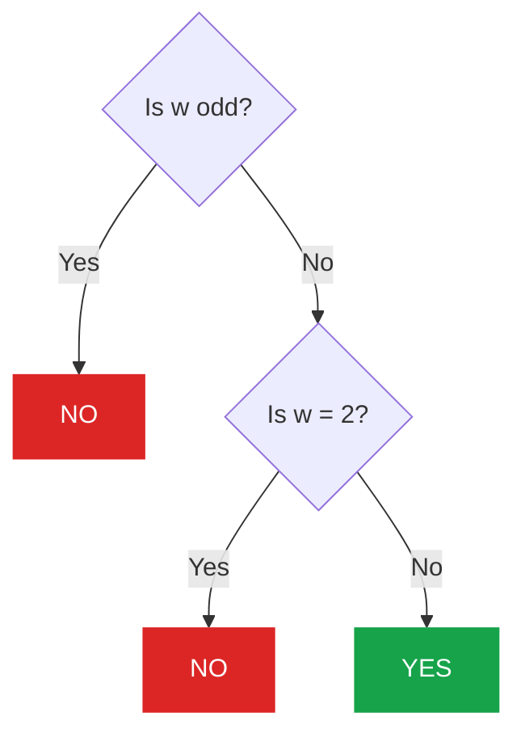

# 4A — Watermelon

<div class="cf-problem-meta">
  <span class="cf-meta-item">🏷️ <strong>4A</strong></span>
  <span class="cf-meta-item">⭐ Difficulty: <span class="cf-diff-badge diff-newbie">800</span></span>
  <span class="cf-meta-item">🔗 <a href="https://codeforces.com/problemset/problem/4/A" target="_blank">Open on Codeforces</a></span>
  <span class="cf-meta-item">🏷️ math · greedy</span>
</div>

## Key observations

[1] Sum of two even numbers is even.
 
**Proof**: Given two even number $x = 2k_{1}$ and $y = 2k_{2}$, where $k_{i} \in \mathbb{Z}$. 
Then the sum of $x$ and $y$ is:

$$ 
\begin{align*}
x + y &= 2k_{1} + 2k_{2} \\
&= 2 \left( k_{1} + k_{2} \right) \\
&= 2k
\end{align*}
$$

[2] Sum of an even and an odd is odd.

**Proof**: Given an even number $x = 2k_{1}$ and an odd number $y = 2k_{2} + 1$, where $k_{i} \in \mathbb{Z}$.
Then the sum of $x$ and $y$ is:

$$ 
\begin{align*}
x + y &= 2k_{1} + 2k_{2} + 1 \\
&= 2 \left( k_{1} + k_{2} \right) + 1 \\
&= 2k + 1
\end{align*}
$$

## Solution

1. If $w$ is **odd**, then the sum of two even numbers is even [1], never odd [2]. Then we need to print `NO`. Check if a number is even, we can check its LSB (Least Significant Bit) `w & 1` instead of `w % 2 == 0`. The LSB of an even number if always 0, while an odd number is always 1.
2. If $w = 2 = 1 + 1$, then it's impossible to split $w$ into even numbers given $1$ is odd. Print `NO`.
3. Otherwise $w$ is even and $w > 2$, then it's possible to split $w$ into two even numbers [1]. Print `YES`.

---

## Decision Tree



---

## Complexity

!!! note "Complexity Analysis"
    | | Value |
    |--|--|
    | **Time** | $O(1)$ |
    | **Space** | $O(1)$ |

---

## Code

=== "Python"

    ```python
    w = int(input())
    
    if w == 2:
        print("NO")
    elif w & 1:
        print("NO")
    else:
        print("YES")
    ```

=== "C++17"

    ```cpp
    #include<bits/stdc++.h>
    #define ios ios_base::sync_with_stdio(0); cin.tie(0); cout.tie(0);
    
    using namespace std;
    
    int main(){
        ios
    
        int w;
        cin >> w;
    
        if(w == 2){
            cout << "NO";
            return 0;
        }
        if(w & 1){
            cout << "NO";
            return 0;
        }
    
        cout << "YES";
        return 0;
    }
    ```
